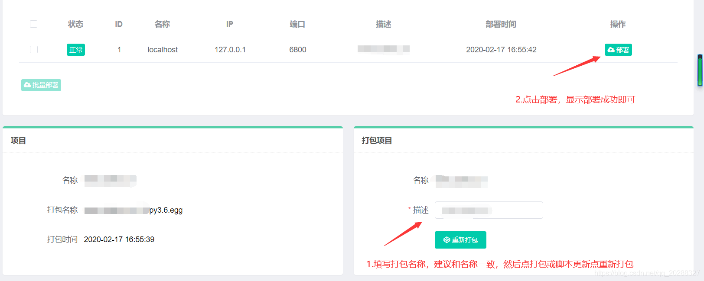

## gerapy介绍
Gerapy 是一款分布式爬虫管理框架，支持 Python 3，基于 Scrapy、Scrapyd、Scrapyd-Client、Scrapy-Redis、Scrapyd-API、Scrapy-Splash、Jinjia2、Django、Vue.js 开发

## gerapy的初始化配置：

安装gerapy框架。（注意要先用命令进入虚拟环境）
1. 命令：pip install gerapy
2. 检查gerapy是否可用。
命令：gerapy

3. 创建工作的文件目录，该目录下初始化项目（文件名随意）用命令行执行
gerapy init
4. 初始化数据库
cd gerapy
gerapy migrate

5. 创建超级用户（记住用户名和密码)
gerapy initadmin

6. 启动服务了，启动服务（可指定url和port）
gerapy runserver 你的ip+端口（0.0.0.0:8000）
scrapyd 或者 /usr/local/python3/bin/scrapyd

7. 进入管理平台（浏览器输入） 举例这样在本地打开
http://127.0.0.1:8000

## 主机管理

创建主机名称（机器名称：能区分出来就行）
创建主机IP（IP网段：略）
创建主机端口（端口号：一般默认6800）
认证：目前这个用户名对和错都能正常运行

## 项目管理
1. 将我们写好的scrapy的工程project目录复制到gerapy中的project复制过来就行，然后会在页面中直接显示你的项目目录。
2. 部署之

